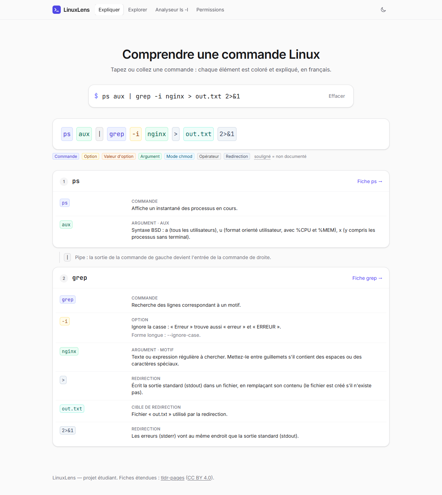
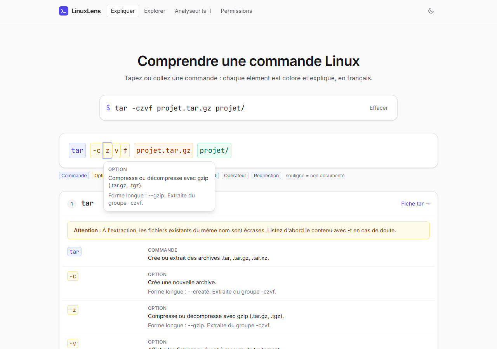
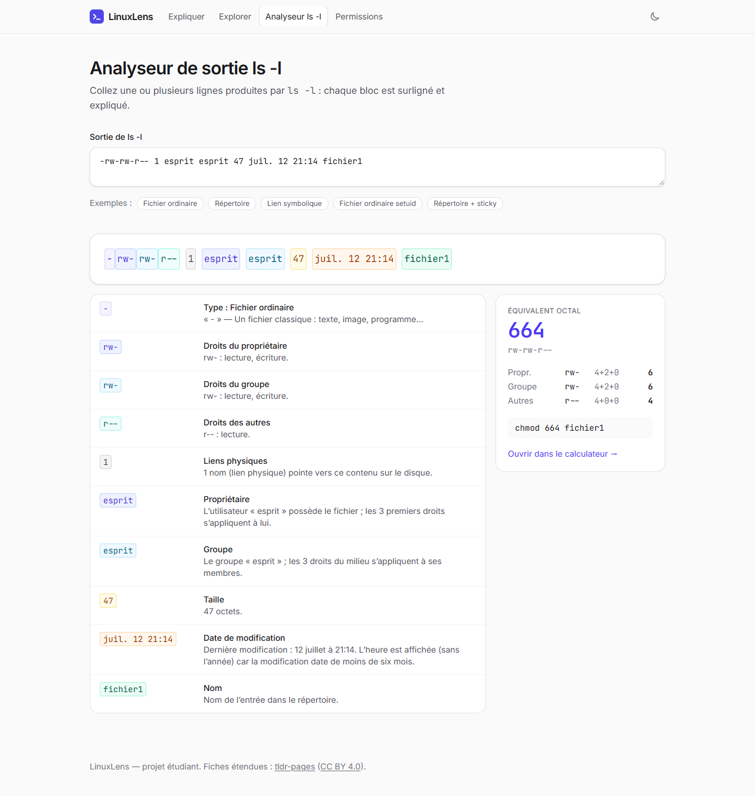
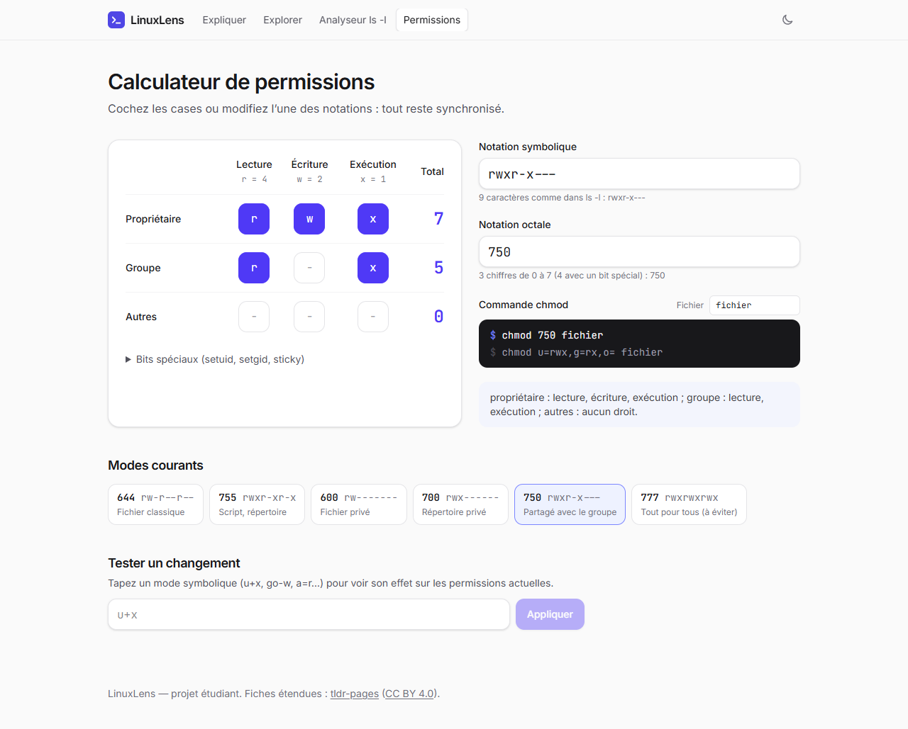
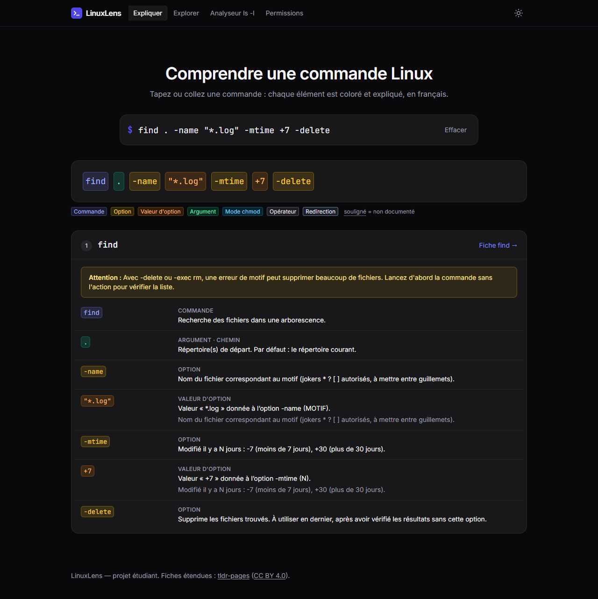
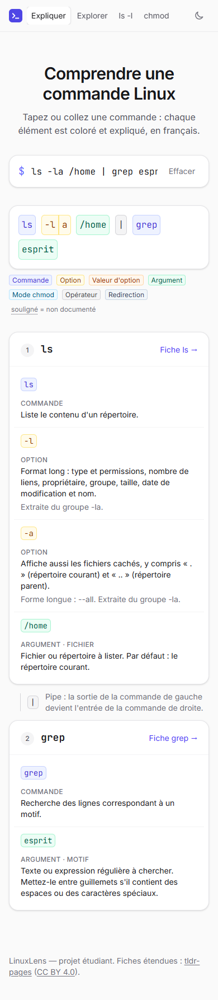

# LinuxLens

**Comprendre visuellement les commandes shell Linux, en français.**

LinuxLens découpe une ligne de commande en éléments colorés (commande, options, arguments, pipes, redirections) et explique chacun d’eux. L’application propose aussi un analyseur de sortie `ls -l`, un calculateur de permissions `chmod` et des exercices corrigés automatiquement. Sans compte, tout tourne dans le navigateur ; les comptes, facultatifs, s’appuient sur Supabase.



## Fonctionnalités

### Expliquer une commande
- Grand champ de saisie avec **autocomplétion** des noms de commandes (clavier : ↑ ↓, Entrée, Tab, Échap).
- Chaque élément est **coloré selon son rôle** et expliqué au survol, au focus clavier ou au clic.
- **Options groupées** éclatées (`-la` → `-l` et `-a`), options longues (`--color=auto`), valeurs d’options (`head -n 5`, `tar -xzvf archive.tar.gz`).
- **Pipes** (`|`), **redirections** (`>`, `>>`, `<`, `2>`, `2>&1`, `&>`) et **enchaînements** (`&&`, `||`, `;`, `&`) : chaque segment est expliqué séparément.
- Modes **chmod** octaux (`755`) et symboliques (`u+x`, `go-w`) traduits en phrases.
- Commandes « enveloppes » reconnues (`sudo apt install`, `xargs rm`).
- Avertissements pour les commandes risquées (`rm`, `chmod`, `sed -i`…).
- L’URL contient la commande (`/?c=ls%20-la`) : chaque explication peut être partagée.



### Trois niveaux de couverture
1. **Fiches détaillées**, écrites à la main (`src/data/commands/*.json`) : description, chaque option, arguments, exemples avec sortie.
2. **tldr-pages** : plus de 6 600 commandes Linux et communes, en français quand la traduction existe, sinon en anglais, avec la mention « Source : tldr-pages » et la licence.
3. **Commande inconnue** : le découpage en tokens reste affiché, avec un message clair.

### Analyseur de sortie `ls -l`
Collez `-rw-rw-r-- 1 esprit esprit 47 juil. 12 21:14 fichier1` : chaque bloc est surligné et expliqué (type, droits par catégorie, liens, propriétaire, groupe, taille, date, nom), avec l’équivalent octal (`664`). Cas gérés : liens symboliques, répertoires, périphériques, setuid/setgid/sticky, ACL (`+`), SELinux (`.`), dates en français, anglais, allemand, espagnol et ISO, année à la place de l’heure, `ls -li`, `ls -lh`, plusieurs lignes et `total`.



### Calculateur de permissions
Grille lecture/écriture/exécution × propriétaire/groupe/autres, synchronisée dans les deux sens avec la notation symbolique (`rwxr-x---`), l’octal (`750`) et la commande `chmod`. Il gère aussi les bits spéciaux, propose des modes courants et un testeur de modes symboliques (`u+x`, `g=u`…).



### S’exercer
Plus de 75 exercices corrigés automatiquement, avec progression mémorisée dans le navigateur, ou dans le compte si l’on est connecté :
- **Écrire la commande** : une consigne en français, avec indice et solution. La correction compare des formes canoniques, donc toutes les écritures équivalentes sont acceptées : `ls -la` = `ls -al` = `ls -l --all`, `head -n5` = `head -n 5`, `chmod 755` = `chmod u=rwx,go=rx`. En cas d’erreur, un message ciblé guide sans donner la réponse (« Il manque une option », « L’option -R n’est pas nécessaire ici »…).
- **Comprendre** : QCM sur ce que fait une commande (opérateurs, redirections, signaux…).
- **Permissions** : conversions octal ↔ rwx, bits spéciaux compris.

### Et aussi
- Page **Explorer** : toutes les commandes par catégorie, avec une recherche insensible aux accents.
- **Mode sombre** en option (clair par défaut, choix mémorisé).
- **Responsive** et **accessible** : navigation clavier, rôles ARIA (combobox, tooltip), lien d’évitement, contrastes AA, `prefers-reduced-motion`.

| Mode sombre | Mobile |
|---|---|
|  |  |

## Installation

Prérequis : Node.js 20 ou plus récent.

```bash
npm install
npm run tldr     # télécharge et convertit tldr-pages dans public/tldr/ (facultatif en dev)
npm run dev      # http://localhost:5173
```

| Script | Rôle |
|---|---|
| `npm run dev` | Serveur de développement |
| `npm test` | Tests unitaires et de composants (Vitest) |
| `npm run typecheck` | Vérification TypeScript |
| `npm run tldr` | Génère les données tldr (`--refresh` pour ignorer le cache) |
| `npm run seo` | Génère `robots.txt` et `sitemap.xml` (URL du site : `SITE_URL`) |
| `npm run build` | Génère tldr et SEO (`prebuild`), vérifie les types puis construit `dist/` |

### Comptes et base de données (Supabase)

Les comptes sont facultatifs : ils synchronisent la progression des exercices, les commandes favorites et l’historique des commandes expliquées.

Sans configuration, l’application tourne en **mode démo** : inscription, connexion et données fonctionnent, mais tout reste dans le navigateur (un bandeau le signale). Pour brancher une vraie base :

1. Créer un projet sur [supabase.com](https://supabase.com).
2. Dans **SQL Editor**, exécuter [`supabase/schema.sql`](supabase/schema.sql) : il crée les tables `exercise_progress`, `exercise_attempts` (chaque réponse, pour les statistiques de « Mon compte »), `favorites` et `history`, active la Row Level Security (chacun ne voit que ses lignes) et ajoute la fonction `delete_user()` pour la suppression de compte.
3. Dans **Authentication → URL Configuration**, déclarer l’URL du site (et `http://localhost:5173` en développement) : les liens de confirmation et de réinitialisation y renvoient (`/connexion`, `/nouveau-mot-de-passe`).
4. Copier `.env.example` en `.env.local` et renseigner `VITE_SUPABASE_URL` et `VITE_SUPABASE_ANON_KEY` (**Project Settings → API**). Sur Vercel, ajouter les mêmes variables dans les réglages du projet.

La clé « anon » est publique par conception : la sécurité repose sur les règles RLS. La clé `service_role` ne doit jamais être utilisée côté navigateur.

### Déploiement sur Vercel
Importer le dépôt : Vercel détecte Vite (build `npm run build`, sortie `dist`). Le script `prebuild` télécharge tldr-pages à chaque déploiement ; en CI et sur Vercel, un échec de ce téléchargement fait échouer le build plutôt que de publier un site sans ses fiches.

- **Sitemap** : généré avec le domaine de production fourni par Vercel. Pour un domaine personnalisé, définir `SITE_URL` (ex. `https://linuxlens.fr`) dans les variables d’environnement.
- **`vercel.json`** : redirige les routes de l’application vers `index.html` (sauf `tldr/` et `assets/`), met en cache longue durée les fichiers versionnés et ajoute les en-têtes de sécurité (CSP, HSTS, `nosniff`…). La CSP autorise le script de thème de `index.html` par son empreinte SHA-256 : si ce script change, `scripts/vercel-config.test.ts` échoue et indique l’empreinte à recopier.
- **CI** : `.github/workflows/ci.yml` vérifie les types, lance les tests et le build à chaque push et pull request.

## Structure

```
scripts/             build-tldr.ts (téléchargement) + tldr-convert.ts (conversion testée)
supabase/            schema.sql : tables, règles RLS, suppression de compte
src/
  types/             command.ts (schéma des fiches), parser.ts, lsl.ts
  lib/               parser.ts, explain.ts, exercise.ts, permissions.ts, chmod.ts, lsl.ts, registry.ts, schema.ts, search.ts
  data/              commands/*.json (fiches détaillées), exercises.ts, categories.ts, index.ts
  components/        explain/, permissions/, practice/, auth/, layout/, ui/
  hooks/             useTheme, useTldr (chargement à la demande), useAuth, useProgress, useFavorites
  lib/backend/       interface commune : demo.ts (navigateur) et supabase.ts (base réelle)
  pages/             Expliquer, Explorer, fiche, ls -l, chmod, exercices, confidentialité
  pages/auth/        connexion, inscription, mot de passe oublié / nouveau, mon compte
```

## Choix techniques

- **Parseur maison, pur et testé** (`src/lib/parser.ts`). Un lexer gère les guillemets, les échappements, `$(…)`, les backticks et les opérateurs. Une seconde passe classe chaque mot selon sa position : commande, option, valeur, argument, mode chmod, cible de redirection. Le parseur ne dépend pas des fiches : un `ParserSpec` optionnel lui indique quelles options attendent une valeur. Chaque token garde sa position exacte, ce qui permet le surlignage.
- **Une fiche = un fichier JSON**, validée par un schéma TypeScript (`CommandDoc`) et par un validateur exécuté en test. Les tests vérifient aussi que chaque exemple se parse sans erreur et contient bien la commande.
- **tldr-pages chargé à la demande** : un index léger (nom + résumé) sert à la recherche et à l’autocomplétion ; la fiche complète n’est téléchargée qu’à l’ouverture. Les fichiers générés ne sont pas versionnés.
- **Logique séparée de l’interface** : l’explication (`explain.ts`), les permissions et l’analyse `ls -l` sont des fonctions pures, testées sans DOM.
- **Backend interchangeable** : les pages dépendent d’une interface (`Backend`) et non de Supabase. Une implémentation locale permet de développer et de tester sans base de données ; Supabase prend le relais dès que les variables d’environnement sont présentes.
- **Chargement à la demande** : seule la page d’accueil est dans le bundle initial ; les autres pages, et la bibliothèque Supabase, sont téléchargées quand on en a besoin. Une *error boundary* affiche un message (et propose de recharger après un nouveau déploiement) au lieu d’un écran blanc.
- **État dans l’URL** (`?c=`, `?l=`, `?mode=`) : pages partageables, sans gestionnaire d’état.
- **Stack** : React 19, TypeScript strict (`noUncheckedIndexedAccess`), Vite, Tailwind CSS 4, React Router, Vitest + Testing Library. Polices Inter et JetBrains Mono auto-hébergées (`@fontsource`).

## Ajouter une commande détaillée

Créer `src/data/commands/<nom>.json` en suivant le type `CommandDoc` (`src/types/command.ts`), puis lancer `npm test`. Le test de schéma signale les champs manquants ou mal formés et les exemples qui ne se parsent pas.

## Crédits

- Fiches étendues : [tldr-pages](https://github.com/tldr-pages/tldr), © les contributeurs tldr-pages, sous licence [CC BY 4.0](https://github.com/tldr-pages/tldr/blob/main/LICENSE.md). Les pages sont converties en JSON (placeholders `{{…}}` simplifiés) sans autre modification de contenu.
- Polices : [Inter](https://rsms.me/inter/) et [JetBrains Mono](https://www.jetbrains.com/lp/mono/), licence SIL OFL.
